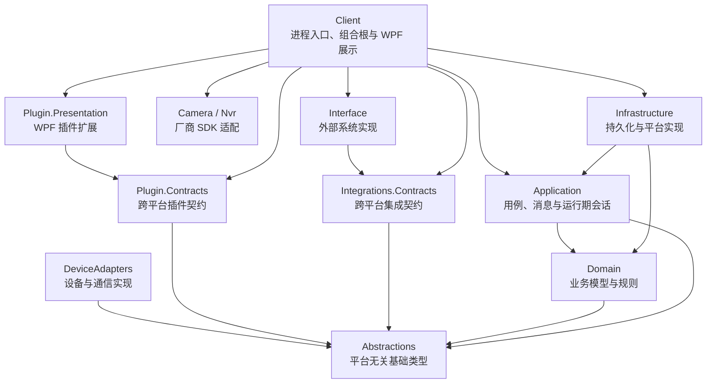

# JayTom DWS 架构边界

本目录记录结构与分层优化后的目标架构、60 项实施证据和关键决策。可执行约束位于 `eng/ArchitecturePolicy.json`，并由 `JayTom.Dws.Tests/Architecture` 中的测试持续验证。

## 约束

- `Abstractions`、`Domain`、`Application`、`Integrations.Contracts`、`Plugin.Contracts` 保持 `net10.0` 和平台无关。
- WPF 进程入口和组合根只存在于 `Client`；不再维护没有独立部署价值的转发 Host。
- 供应商 SDK、原生文件和平台对象留在适配项目，不进入核心契约。
- 持久化注册与上下文生命周期归 `Infrastructure` 所有。
- Client 不直接访问遗留 `PackageInfoManager`，统一通过 `IPackageSessionStore`。
- 项目引用图、禁止包、编译所有权和关键源码边界由测试保护。

## 索引

- [60 项实施台账](optimization-register.md)
- [60 项语义问题整改台账](semantic-remediation-register.md)
- [既有 SQLite 数据库兼容策略](database-compatibility-policy.md)
- [ADR-0001：平台无关核心](adr/0001-platform-neutral-core.md)
- [ADR-0002：WPF 宿主与组合根](adr/0002-wpf-host-and-composition-root.md)
- [ADR-0003：持久化边界](adr/0003-persistence-ownership.md)
- [ADR-0004：集成与设备适配](adr/0004-integration-and-device-adapters.md)
- [ADR-0005：插件契约与架构治理](adr/0005-plugin-contracts-and-governance.md)
